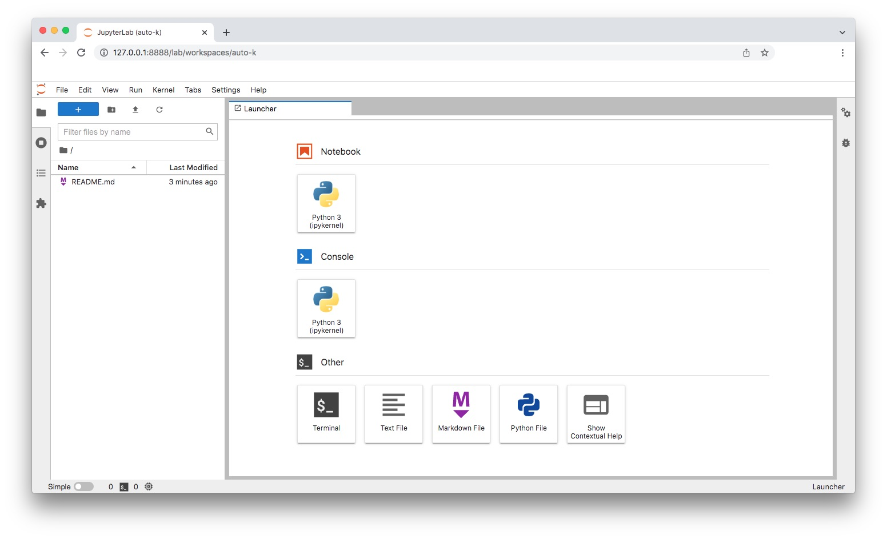

## IR-lab: Εργαστήριο ανάκτησης πληροφορίας

    Εργαστήριο Γαληνός: Παρασκευή, 11:00πμ

---

### Web scrapping (python)

Θα αξιοποιήσουμε [jupyter lab](https://jupyter.org/) για την υλοποίηση ενός απλού web scrapper.  
Θα κάνουμε αξιοποίηση στο μηχάνημά μας και σε google colab.

* Εγκατάσταση jupyter lab σε ένα docker container (για να είναι disposable :-), μπορείτε όμως να <span style="background-color: #FFFFA0">προσπεράσετε τη χρήση docker (αγνοήστε το κίτρινο highlight)</span> και να κάνετε native εγκατάσταση στο μηχάνημά/λειτουργικό σας.
    * <span style="background-color: #FFFFA0">Δημιουργία ενός python container  
    ```docker run --name jupyter -ti -p 8888:8888 -v `pwd`:/jupyter python:latest /bin/bash```  
    Το `-p` θα μας παρέχει πρόσβαση στο web server που θα ξεκινήσει εντός του container και θα _ακούει_ στο port `8888`.  
    Το `-v` κάνει map το τρέχον directory στο `/jupyter` εντός του container (αυτό το directory θα είναι διαθέσιμο και στο host λειτουργικό μας και μέσα στον container)</span>
    * Εγκατάσταση του jupyter lab  
    ```pip install jupyterlab```
    * Εκκίνηση του jupyter lab  
    ```jupyter-lab --ip 0.0.0.0 --port 8888 --allow-root```
    * Ελέγξτε στο terminal για το `token` το οποίο σας δίνει πρόσβαση στο jupyter lab, πχ:
    ```
    [C 2022-02-24 04:48:56.534 ServerApp]

    To access the server, open this file in a browser:
        file:///root/.local/share/jupyter/runtime/jpserver-27-open.html
    Or copy and paste one of these URLs:
        http://de00f90ffb61:8888/lab?token=fe8650eb49bdace494ab617f7b922535f33758fea99c824c
     or http://127.0.0.1:8888/lab?token=fe8650eb49bdace494ab617f7b922535f33758fea99c824c
    ```
    Χρησιμοποιήστε το url τύπου `http://127.0.0.1:8888/lab?token=...`
    * Καλώς ήρθατε στο lab σας:  
    
    * Γνωρίστε καλύτερα το jupyter lab:
        * https://www.dataquest.io/blog/jupyter-notebook-tutorial/
        * https://docs.jupyter.org/en/latest/

* Δημιουργήστε ένα `Python 3 notebook` και ξεκινάμε για το web scrapping
    * Μελετήστε τον κώδικα που περιγράφει πώς κάνουμε web scrapping με χρήση της βιβλιοθήκης Beautiful Soup της python: https://realpython.com/python-web-scraping-practical-introduction/#use-an-html-parser-for-web-scraping-in-python  
    * Δημιουργήστε ένα notebook στο οποίο να κάνετε scrap τα έργα του [Shakespeare](http://shakespeare.mit.edu/), αποθηκεύοντας κάθε έργο σε μορφή απλού κειμένου σε ένα ξεχωριστό αρχείο με όνομα τον τίτλο του έργου. Αναμίξτε τον κώδικα python που γράφετε με block κειμένου markdown στα οποία εξηγείτε τι κάνετε σε κάθε (ουσιώδες) βήμα.
    * Happy coding :-)
    * Όταν ολοκληρώσετε το notebook σας, αποθηκεύστε το τοπικά στον υπολογιστή σας (Download) και στη συνέχεια ανεβάστε το στο https://colab.research.google.com/. Δοκιμάστε να εκτελέσετε εκεί το notebook που φτιάξατε στο δικό σας jupyter lab.

 [_Μία_ λύση](./notebooks/simple-scrap.ipynb).

---

### Term-Document Matrix (python)

Θα αξιοποιήσουμε το jupyter lab που δημιουργήσαμε την προηγούμενη εβδομάδα.  

* Εκκίνηση του container και του jupyter lab.  
```
docker start jupyter
docker attach jupyter
cd /jupyter/
jupyter-lab --ip 0.0.0.0 --port 8888 --allow-root
```
* Σε ένα browser στο host λειτουργικό μας επισκεπτόμαστε `http://127.0.0.1:8888/lab?token=__<token σας>__`
    * Δημιουργήστε ένα νέο `Python 3 notebook`.
* Αξιοποιήστε κώδικα από το περασμένο εργαστήριο ώστε να κάνετε web scrap όλα τα ονόματα χαρακτήρων και όλα τα έργα στα οποία εμφανίζεται ο αντίστοιχος χαρακτήρας από τη σελίδα https://www.opensourceshakespeare.org/views/plays/characters/chardisplay.php  
    * Αξιοποιήστε τη μέθοδο `find_all()` ενός `BeautifulSoup` αντικειμένου για να βρείτε, όλα τα `table`, μετά τα `tr` και τέλος τα `td` elements εντός των οποίων βρίσκεται η πληροφορία που αναζητάτε.
* Για κάθε χαρακτήρα δημιουργήστε ένα [bitarray](https://pypi.org/project/bitarray/) μήκους όσο το πλήθος των έργων του Shakespeare. Στο bitarray το `0` στη θέση bit `i` να αναπαριστά ότι ο χαρακτήρας δεν εμφανίζεται στο `i`-οστό έργο του Shakespeare, ενώ η τιμή `1` ότι εμφανίζεται.  
Δείγμα bitarray:
```
Aaron                          0000000000000000000000000000000001000
Abbot                          0001000000000000000000000000000000000
Abhorson                       0000000000000000000000000001000000000
Abraham                        0000000100000000000000000000000000000
Achilles                       0000000000000001000000000000000000000
Adam                           0000000000000000000100000000000000000
```
* Αποθηκεύστε όλα αυτά τα bitarrays σε ένα `dict()`, με ονομασία έστω `TDM`.
* Πλέον μπορείτε να κάνετε ερωτήματα με bitwise operators για να βρείτε έργα στα οποία δύο χαρακτήρες εμφανίζονται μαζί ή εμφανίζεται ο ένας αλλά όχι ο άλλος, κ.ο.κ. Πχ
```
term1 = TDM['Romeo']
term2 = TDM['Juliet']
res = (term1 & term2)
print(res)
```  
δίνει αποτέλεσμα: `0000000100000000000000000000000000000`, το 8<sup>ο</sup> έργο είναι το _Romeo and Juliet_.   
```
term1 = TDM['Romeo']
term2 = TDM['Juliet']
res = (term1 & ~term2)
print(res)
```  
δίνει αποτέλεσμα: `0000000000000000000000000000000000000`, δεν υπάρχει έργο στο οποίο εμφανίζεται ο Romeo αλλά όχι η Juliet.

 [_Μία_ λύση](./notebooks/term-document-matrix.ipynb).

---

### Inverted Index (python)

Θα αξιοποιήσουμε το jupyter lab και τα κείμενα των έργων του Shakespeare από το εργαστήριο της πρώτης εβδομάδας.

Μελετήστε το υλικό του βιβλίου Introduction to Information Retrieval σχετικά με την [υλοποίηση Inverted Indexes](https://nlp.stanford.edu/IR-book/html/htmledition/a-first-take-at-building-an-inverted-index-1.html). Ουσιαστικά για κάθε όρο που εμφανίζεται σε κάθε κείμενο δημιουργούμε με λίστα αναφορών σε κάθε κείμενο που ο όρος αυτός εμφανίζεται.  
Κατά τη δημιουργία του index γίνεται και κάποια προεπεξεργασία των όρων των κειμένων, ώστε πχ όροι που εμφανίζονται σε ενικό και πληθυντικό να μην θεωρούνται διαφορετικοί, αλλά αυτό θα το δούμε σε επόμενο εργαστήριο.

Βασικές έννοιες που θα αναφερόμαστε:
* Document: ένα συγκεκριμένο έγγραφό μέσα σε ένα ευρύτερο πλήθος
    * Document ID: ένα μοναδικο αναγνωριστικό για κάθε κείμενο
* Token & Normalised token: όροι (λέξεις) που εμφανίζονται στο κείμενο, για τώρα θεωρούμε ότι ταυτίζονται, θα δούμε διαφορές όταν κάνουμε προεπεξεργασία.
* Term Document Frequency: πλήθος εγγράφων στο οποίο εμφανίζεται ένας όρος.
* Postings list: Λίστα Document IDs των κειμένων στα οποία εμφανίζεται ένας όρος.

Δημιουργία Inverted Index (αναλυτικά, όπως στη πιο πάνω πηγή):
0. Δημιουργήστε μια κενή λίστα στην οποία θα εισάγετε κάθε λέξη που συναντάτε σε ένα κείμενο, δημιοργήστε ένα λεξικό των ονομάτων των κειμένων και του κωδικού κάθε κειμένου: {`Document`:`DocID`}
1. Διαβάστε ένα-ένα τα κείμενα του Shakespeare και δημιουργήστε λίστες από [`tuples`](https://docs.python.org/3/tutorial/datastructures.html#tuples-and-sequences) token-DocID.  
Το python module [`glob`](https://docs.python.org/3/library/glob.html) επιτρέπει να κάνετε pattern matching και να πάρετε όλα τα txt αρχεία σε ένα φάκελο, πχ `glob.glob("./shakespeare/*.txt")`.  
Μπορείτε να διαβάετε ένα αρχείο γραμμή-γραμμή (καθαρίζοντας και το whitespace στο τέλος κάθε γραμμής):
```
with open(filename) as file:
    for line in file:
        print(line.rstrip())
```  
Μπορείτε να σπάσετε ένα string σε tokens με χρήση της [`split()`](https://docs.python.org/3.3/library/stdtypes.html?highlight=split#str.split).   
Παρότι δεν κάνουμε προεπεξεργασία, αποφύγετε να εισάγετε τα σημεία στίξης στη λίστα των tuples, απορίψτε tokens όπως `!\"'#$%&()*+-./:;<=>?@[\]^_``{|}~\n`.

    _1.debug Εκτυπώστε τα 10 πρώτα tuples της λίστας, για έλεγχο, πχ:_
    ```
    [('Nights', 1), ('Dream', 1), ('Entire', 1), ('Play', 1), ('A', 1), ('Midsummer', 1), ('Nights', 1), ('Dream', 1), ('Shakespeare', 1)]    
    ```

2. Δημιουργήστε μια ταξινομημένη (βάσει των token) λίστα των tuples.  
Χρησιμοποιήστε μια [lambda expression](https://www.w3schools.com/python/python_lambda.asp) για να επιλέξετε το κλειδί της ταξινόμησης (το πρώτο στοιχείο σε κάθε tuple).  
Πχ: η λ έκφραση `TDiD.sort(key=lambda tpl: tpl[0])` ταξινομεί το TDiD βάσει του πρώτου στοιχείου κάθε token, δλδ με βάσει τις λέξεις των κειμένων.

    _2.debug Εκτυπώστε τα 10 πρώτα tuples της λίστας, για έλεγχο, πχ:_
    ```
    1 5
    1 5
    1 8
    1 8
    1 11
    ...
    9 11
    A 1
    A 1
    A 1
    A 1
    A 1
    A 1
    A 1
    A 1
    A 1
    A 1
    A 1
    A 1
    A 1
    A 1
    A 1
    A 1
    A 1
    A 1
    A 1
    A 1
    A 1
    A 1
    A 1    
    ```

3. Διατρέξτε όλη τη λίστα των tuples και για κάθε ξεχωριστό token δημιουργήστε ένα σύνολο (`set`) με αναφορές στα Document IDs των κειμένων στα οποία εμφανίζεται κάθε token. Χρησιμοποιήστε set για να εξασφαλίσετε ότι δεν υπάρχουν διπλότυπα για κανένα token. Αποθηκεύστε τα ζέυγη `term`-`set` σε ένα λεξικό (`dictionary`).

    _3.debug Εκτυπώστε τα 20 πρώτα στοιχεία του λεξικού, για έλεγχο, πχ_
    ```
    1 {8, 11, 5}
    ...
    9 {11}
    A {1, 2, 3, 4, 5, 6, 7, 8, 9, 10, 11, 12, 13, 14, 15, 16, 17, 18, 19, 20, 21, 22, 23, 24, 25, 26}
    ABERGAVENNY {11}
    ABHORSON {14}
    ACHILLES {23}
    ```

4. Δημιουργήστε από το τελευταίο λεξικό, ένα νέο λεξικό το οποίο να περιέχει ζέυγη από terms και _**ταξινομημένες λίστες**_ των DocID στα οποία εμφανίζεται το term.   
    ```
    1                              [  3] =>	 [5, 8, 11]
    ...
    9                              [  1] =>	 [11]
    A                              [ 26] =>	 [1, 2, 3, 4, 5, 6, 7, 8, 9, 10, 11, 12, 13, 14, 15, 16, 17, 18, 19, 20, 21, 22, 23, 24, 25, 26]
    ABERGAVENNY                    [  1] =>	 [11]
    ABHORSON                       [  1] =>	 [14]
    ACHILLES                       [  1] =>	 [23]
    ACT                            [ 26] =>	 [1, 2, 3, 4, 5, 6, 7, 8, 9, 10, 11, 12, 13, 14, 15, 16, 17, 18, 19, 20, 21, 22, 23, 24, 25, 26]    
    ```

**Food for thought (_ToDO?_):**

* Παραδειγμα `and` αναζήτησης


* Παραδειγμα `or` αναζήτησης


* Παραδειγμα `not` αναζήτησης


<small style="font-size:6pt">Πηγή εικόνων: https://medium.com/@shahikhashayar/and-or-and-not-boolean-queries-on-inverted-indexes-in-python-8030bb5d9098</small>
